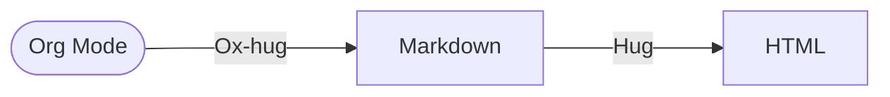

## My Blog

### Org-Mode + Hugo

The contents of this blog is originally written in Emacs Org mode. The webpages are generated by the following procedure:



### Running Locally

To run the website on port 1313, simply run `./run.sh`, or:
```sh
hugo server --buildDrafts --navigateToChanged
```

