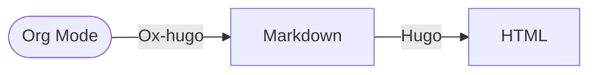

## My Blog

A minimal blog based on Markdown and Hugo.

### (Deprecated) Org-Mode + Hugo

This blog was originally written in Emacs Org mode, where the webpages were generated by the following procedure:



### Running Locally

To run the website on port 1313, simply run `./run.sh`, or:
```sh
hugo server --buildDrafts --navigateToChanged
```

